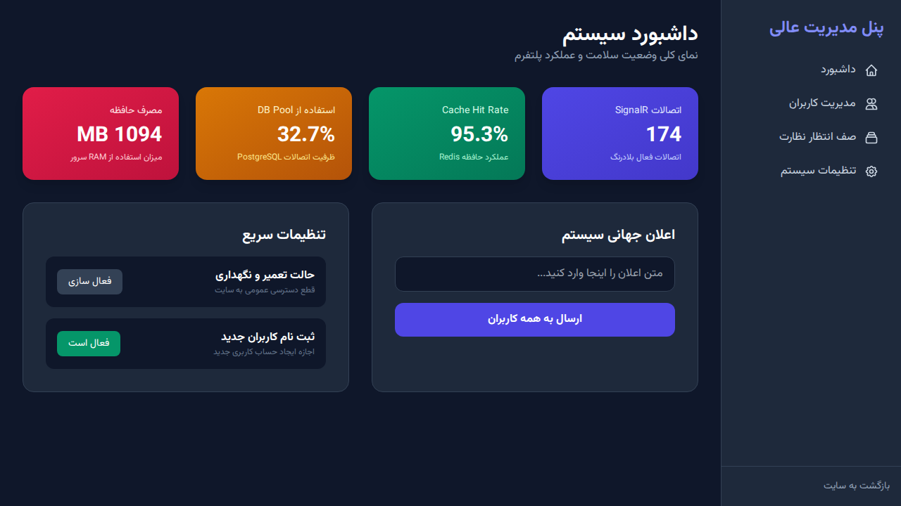
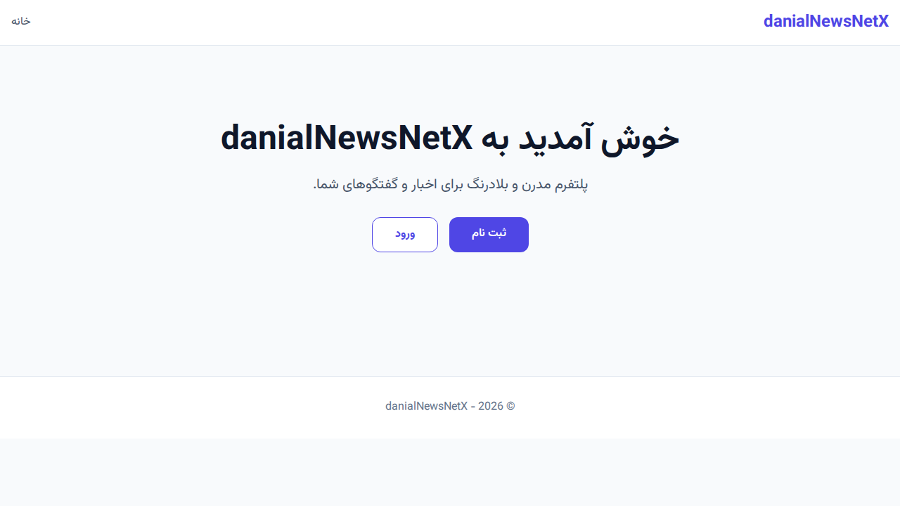

# danialNewsNetX

پلتفرم میکروبلاگینگ و اخبار اجتماعی با کارایی بالا، طراحی شده به عنوان یک کلون کامل از X (توییتر سابق). این پروژه با استفاده از معماری تمیز (Clean Architecture) در .NET 10 پیاده‌سازی شده است.

## ویژگی‌های کلیدی
- **معماری تمیز:** جداسازی لایه‌های Domain، Application، Infrastructure و WebUI.
- **CQRS:** پیاده‌سازی الگوی CQRS با استفاده از MediatR.
- **به‌روزرسانی‌های بلادرنگ:** استفاده از SignalR برای فیدها و نوتیفیکیشن‌های زنده.
- **طراحی RTL:** رابط کاربری کاملاً فارسی و راست‌چین با استفاده از Tailwind CSS و فونت "Vazirmatn".
- **بدون ایموجی:** رعایت محدودیت سخت‌گیرانه برای عدم استفاده از هرگونه ایموجی در کل سیستم.
- **پنل مدیریت عالی پیشرفته:** ابزارهای قدرتمند برای نظارت بر محتوا، مدیریت نقش‌های کاربران و پایش بلادرنگ عملکرد سیستم.

## ساختار پروژه
- **Domain:** شامل موجودیت‌های اصلی مانند User، Post، Story، Follow و تنظیمات سیستم.
- **Application:** شامل منطق تجاری، دستورات (Commands) و پرس‌وجوها (Queries).
- **Infrastructure:** پیاده‌سازی دسترسی به داده‌ها (PostgreSQL)، حافظه پنهان (Redis) و خدمات پس‌زمینه.
- **WebUI:** رابط کاربری وب بر پایه ASP.NET Core MVC و Tailwind CSS.

## راهنمای راه‌اندازی با Docker
برای اجرای کل سیستم شامل اپلیکیشن وب، پایگاه داده PostgreSQL و Redis، دستور زیر را اجرا کنید:

```bash
docker-compose up --build
```

## اعتبارنامه‌های پیش‌فرض
سیستم با داده‌های نمونه و نقش‌های مختلف مقداردهی اولیه می‌شود.

| نقش | ایمیل | رمز عبور |
| :--- | :--- | :--- |
| مدیر عالی | superadmin@danialnet.com | SuperAdmin@123456 |
| کاربر استاندارد | (تولید شده توسط Bogus) | Password123! |

## پیش‌نمایش تصویری
در اینجا پیش‌نمایشی از رابط کاربری پلتفرم آورده شده است:

### داشبورد مدیریت عالی


### صفحه اصلی سایت


---

# danialNewsNetX

A high-performance microblogging and social news platform, designed as a pixel-perfect clone of X (formerly Twitter). This project is implemented using Clean Architecture in .NET 10.

## Key Features
- **Clean Architecture:** Separation of Domain, Application, Infrastructure, and WebUI layers.
- **CQRS:** Implementation of the CQRS pattern using MediatR.
- **Real-Time Updates:** Using SignalR for live feeds and notifications.
- **RTL Design:** Fully localized Persian interface with RTL layout using Tailwind CSS and the "Vazirmatn" font.
- **Emoji-Free:** Strict adherence to a NO EMOJI constraint throughout the system.
- **Advanced Super Admin Panel:** Powerful tools for content moderation, user role management, and real-time performance telemetry.

## Project Structure
- **Domain:** Contains core entities like User, Post, Story, Follow, and system configurations.
- **Application:** Contains business logic, Commands, and Queries.
- **Infrastructure:** Implementation of data access (PostgreSQL), caching (Redis), and background services.
- **WebUI:** Web interface based on ASP.NET Core MVC and Tailwind CSS.

## Setup Guide with Docker
To run the entire system including the web app, PostgreSQL, and Redis, run the following command:

```bash
docker-compose up --build
```

## Default Credentials
The system is initialized with sample data and various roles.

| Role | Email | Password |
| :--- | :--- | :--- |
| Super Admin | superadmin@danialnet.com | SuperAdmin@123456 |
| Standard User | (Generated by Bogus) | Password123! |

